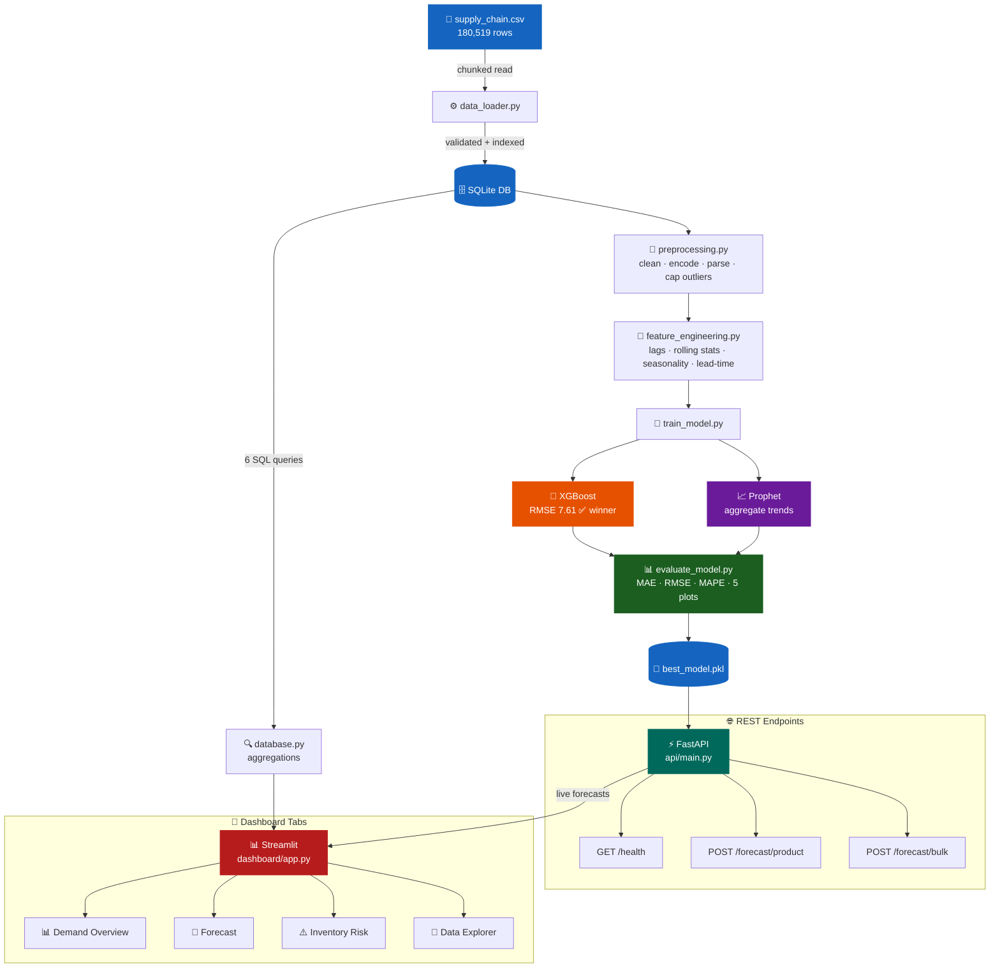

<div align="center">

# 📦 Supply Chain Demand Forecasting

### End-to-end ML system for predicting product demand across global supply chain networks

[](https://python.org)
[](https://xgboost.readthedocs.io)
[](https://fastapi.tiangolo.com)
[](https://streamlit.io)
[](https://sqlite.org)
[](LICENSE)

**[Features](#-features) • [Architecture](#-architecture) • [Quick Start](#-quick-start) • [API Docs](#-api-reference) • [Results](#-model-results)**

</div>

---

## 🎯 Business Problem

Global supply chains lose **billions annually** to three avoidable failures:

```
Stockouts      →  Lost sales + customer churn
Overstocking   →  Tied-up capital + waste  
Late delivery  →  SLA breaches + penalties
```

This system solves all three with data-driven forecasting:

| Problem | Solution | Output |
|:---|:---|:---|
| Can't predict demand | XGBoost on 180K+ orders | 30/60/90-day weekly forecasts per product |
| No category visibility | Bulk forecast API endpoint | Aggregated demand by product category |
| Hidden delivery risk | SQLite risk analysis layer | Inventory alerts with delay scoring |

---

## ✨ Features

- 🔮 **Demand Forecasting** — Per-product weekly forecasts with confidence intervals
- 🤖 **Two ML Models** — XGBoost vs Prophet comparison with automatic winner selection
- 🗄️ **SQL Analytics Layer** — 6 pre-built business queries via SQLite
- ⚡ **REST API** — 3 FastAPI endpoints, fully documented with Swagger UI
- 📊 **Interactive Dashboard** — 4-tab Streamlit app with live forecast integration
- ⚠️ **Risk Alerts** — Automatic flagging of products with chronic shipping delays
- 🧪 **Full Evaluation** — MAE, RMSE, MAPE + 5 diagnostic plots saved to `reports/`

---

## 🏗 Architecture



> **Data flows top to bottom** — CSV → SQLite → Features → Models → API + Dashboard

---

## 🚀 Quick Start

### Prerequisites
- Python 3.11+
- ~2GB free RAM
- Dataset from Kaggle (free)

### 1 — Clone

```bash
git clone https://github.com/YOUR_USERNAME/supply-chain-demand-forecasting.git
cd supply-chain-demand-forecasting
```

### 2 — Install dependencies

```bash
python -m venv .venv

# Windows
.venv\Scripts\activate

# Mac / Linux
source .venv/bin/activate

pip install -r requirements.txt
```

> **Prophet on Windows** — if `pip install` fails on Prophet, use conda instead:
> ```bash
> conda install -c conda-forge prophet
> ```

### 3 — Get the dataset

1. Download from Kaggle → [DataCo Smart Supply Chain Dataset](https://www.kaggle.com/datasets/shashwatwork/dataco-smart-supply-chain-for-big-data-analysis)
2. Place the file here:
```
data/supply_chain.csv
```

### 4 — Run the pipeline

```bash
# Step 1: Load CSV into SQLite database
python src/data_loader.py

# Step 2: Train XGBoost + Prophet, compare, save best model
python src/train_model.py

# Step 3: Generate evaluation metrics + diagnostic plots
python src/evaluate_model.py
```

> Training takes **3–8 minutes** depending on your hardware.

### 5 — Start the API

```bash
python -m uvicorn api.main:app --host 0.0.0.0 --port 8000 --reload
```

📄 Swagger UI → **http://localhost:8000/docs**

### 6 — Launch the dashboard

Open a **second terminal**:

```bash
streamlit run dashboard/app.py
```

📊 Dashboard → **http://localhost:8501**

---

## 📁 Project Structure

```
supply_chain_forecast/
│
├── 📂 data/
│   └── supply_chain.csv          # Download from Kaggle (not committed)
│
├── 📂 notebooks/
│   └── eda.ipynb                 # 8-section EDA with 10+ saved charts
│
├── 📂 src/
│   ├── data_loader.py            # CSV → validate → SQLite (chunked read)
│   ├── database.py               # 6 SQL aggregation queries
│   ├── preprocessing.py          # Clean, parse dates, encode, cap outliers
│   ├── feature_engineering.py    # Lag + rolling + seasonality features
│   ├── train_model.py            # Train XGBoost + Prophet, select winner
│   └── evaluate_model.py         # MAE/RMSE/MAPE + 5 diagnostic plots
│
├── 📂 api/
│   └── main.py                   # FastAPI app — 3 endpoints
│
├── 📂 dashboard/
│   └── app.py                    # Streamlit — 4 interactive tabs
│
├── 📂 models/
│   └── model_metadata.json       # Training metrics + config
│
├── 📂 reports/
│   └── *.png                     # Auto-generated evaluation charts
│
├── requirements.txt
├── README.md
└── .gitignore
```

---

## 🌐 API Reference

### `GET /health`
Liveness check — returns model status and timestamp.

```json
{
  "status": "ok",
  "model_ready": true,
  "best_model": "xgboost",
  "timestamp": "2024-01-15T10:30:00Z"
}
```

---

### `POST /forecast/product`
Forecast demand for a single product over 7–180 days.

**Request**
```json
{
  "product_name": "Smart watch",
  "horizon_days": 30,
  "region": "Southeast Asia"
}
```

**Response**
```json
{
  "product_name": "Smart watch",
  "model_used": "xgboost",
  "horizon_days": 30,
  "forecast": [
    {
      "date": "2024-02-05",
      "predicted_demand": 42.5,
      "lower_bound": 28.3,
      "upper_bound": 56.7
    }
  ],
  "historical_avg_weekly_demand": 38.2,
  "generated_at": "2024-01-15T10:31:00Z"
}
```

---

### `POST /forecast/bulk`
Forecast all products in a category, ranked by predicted demand.

**Request**
```json
{
  "category_name": "Sporting Goods",
  "horizon_days": 60
}
```

---

## 📈 Model Results

> Trained on **180,519 orders** | Test set: last **12 weeks** | **91 unique products**

| Model | MAE | RMSE | MAPE | Scope |
|:---|---:|---:|---:|:---|
| ✅ **XGBoost** | **3.53** | **7.61** | **36.4%** | Per-product weekly forecast |
| Prophet | 706.7 | 736.1 | 2842% | Total aggregate only |

**XGBoost wins decisively** — lag features + rolling statistics give it strong product-level signal that Prophet can't match at SKU granularity.

---

### 🔑 Top Feature Importances (XGBoost — Gain)

| Rank | Feature | What it captures |
|:---:|:---|:---|
| 1 | `demand_lag_1w` | Prior week demand — strongest predictor |
| 2 | `demand_roll_mean_4w` | 4-week smoothed demand trend |
| 3 | `demand_lag_2w` | 2-week lagged demand |
| 4 | `product_name_enc` | Product-specific demand level |
| 5 | `is_holiday_season` | Weeks 47–52 demand surge |
| 6 | `year` | Long-term growth trend |
| 7 | `order_region_enc` | Regional demand patterns |
| 8 | `demand_roll_std_4w` | Demand volatility signal |

---

### 🧩 Feature Engineering Summary

| Group | Features Created |
|:---|:---|
| **Lag features** | `demand_lag_1w`, `2w`, `4w`, `8w`, `12w` |
| **Rolling stats** | `roll_mean` + `roll_std` at 4w / 8w / 12w windows |
| **Seasonality** | `month_sin/cos`, `week_sin/cos`, `quarter`, `is_q4`, `is_year_end`, `is_summer`, `is_holiday_season` |
| **Lead-time** | `shipping_delay`, `delay_ratio`, `is_chronically_late` |
| **Encoded groups** | `product_enc`, `category_enc`, `region_enc`, `market_enc` |

---

## 🖥 Dashboard Preview

| Tab | Description |
|:---|:---|
| 📊 **Demand Overview** | Monthly trend, regional demand, category revenue, top 15 products |
| 🔮 **Forecast** | Live API forecast with 90% confidence intervals + historical context |
| ⚠️ **Inventory Risk** | Late delivery heatmap, most delayed products, critical alerts |
| 🔬 **Data Explorer** | Aggregated tables, category breakdown, monthly trend data |

> Screenshots coming soon — run the dashboard locally to explore.

---

## 🛠 Tech Stack

| Layer | Technology | Purpose |
|:---|:---|:---|
| Data | **Pandas, NumPy** | Cleaning, transformation, feature engineering |
| Storage | **SQLite** | Persistent store + SQL aggregation layer |
| ML | **Scikit-learn** | Preprocessing utilities, label encoding |
| Forecasting | **XGBoost** | Primary demand forecasting model |
| Forecasting | **Prophet** | Time-series decomposition + trend analysis |
| Visualisation | **Matplotlib, Seaborn** | EDA and evaluation diagnostic plots |
| API | **FastAPI + Uvicorn** | REST API serving forecasts |
| Dashboard | **Streamlit** | Interactive analytics frontend |

---

## 🔭 Roadmap / Possible Extensions

- [ ] LSTM model for sequence-based forecasting
- [ ] Weather + promotions as external regressors
- [ ] Automated weekly retraining with Airflow
- [ ] Docker + docker-compose for one-command setup
- [ ] Deploy to Streamlit Cloud (free)
- [ ] Unit tests with pytest

---

## 📄 License

MIT License — free to use, modify, and distribute.

**Dataset:** [DataCo Smart Supply Chain](https://www.kaggle.com/datasets/shashwatwork/dataco-smart-supply-chain-for-big-data-analysis) — public dataset on Kaggle.

---

<div align="center">
Made with Python 🐍 | If this helped you, consider giving it a ⭐
</div>
